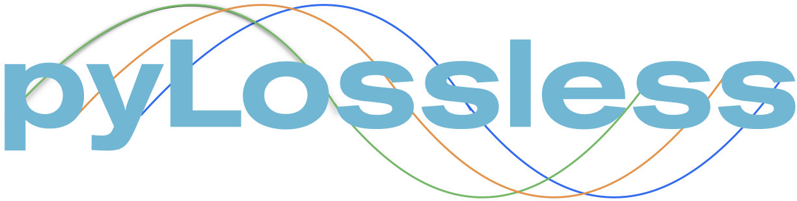

- 🦾 Fully automated EEG processing pipeline built on MNE-Python.
- :recycle: Keeps your EEG recordings in their continuou state.
- 📝 Artifacts are annotated in your raw data.
- 👩‍💻 Use our dashboard to review the pipelines decisions on your files.


# **Note: This software is pre-alpha and not yet ready for outside use!**
## **Alpha release is planned for May 1st 2023**

## 📘 Installation and usage instructions

This package is not yet deployed on PyPI. It can therefore be installed with

```bash
$ git clone git@github.com:lina-usc/pylossless.git
$ pip install --editable ./pylossless
```
for an editable installation, or simply with 
```bash
$ pip install git+https://github.com/lina-usc/pylossless.git
```
for a static version. 

Please find the full documentation at
[**pylossless.readthedocs.io**](https://pylossless.readthedocs.io/en/latest/index.html).


## ▶️ Running the pyLossless Pipeline
Below is a minimal example that runs the pipeline one of MNE's sample files.  
```
import pylossless as ll 
import mne
fname = mne.datasets.sample.data_path() / 'MEG' / 'sample' /  'sample_audvis_raw.fif'
raw = mne.io.read_raw_fif(fname, preload=True).pick_types(eeg=True)  # pick EEG chans.

config = ll.config.Config()
config.load_default()
config.save("my_project_ll_config.yaml")

pipeline = ll.LosslessPipeline('my_project_ll_config.yaml')
pipeline.run_with_raw(raw)
```

Once it is completed, You can see what channels and times were flagged:
```
print(pipeline.flagged_chs)
print(pipeline.flagged_epochs)
```

Once you are ready, you can save your file:
```
pipeline.save(pipeline.get_derivative_path(bids_path), overwrite=True)
```

## 👩‍💻 Dashboard Review


After running the Lossless pipeline, you can launch the Quality Control
Review (QC) dashboard to review the pipeline's decisions on each file!
You can flag additional channels, times and components, and edit flags
made by the pipeline.

First install the dashboard requirements
```bash
$ cd ./path/to/pylossless/on/your/computer
$ pip install --editable .[dash]
```

```bash
$ python pylossless/dash/app.py
```

## Motivation

This project is a port of the MATLAB Lossless EEG Processing Pipeline ([Github repo](https://github.com/BUCANL/EEG-IP-L)) presented in [Desjardins et al (2021)](https://www.sciencedirect.com/science/article/pii/S0165027020303848). This port aims at 1) making this pipeline available to the Python community and 2) providing a version of the pipeline that is easier to deploy by outsiders.

This pipeline is built on the idea that sharing and pooling data across the scientific community is most efficient when sharing a standardized (e.g., in [BIDS](https://www.nature.com/articles/s41597-019-0104-8)) and "clean" version of a dataset. However, cleaning artifacts in a dataset generally results in a loss of data (i.e., the original recorded signals are generally not recoverable). This is particularly problematic given that preprocessing steps for a dataset are rarely perfect (i.e., future developments may offer methods that would perform better at removing some artifacts) and can be project-dependent. The Lossless pipeline addresses this issue by proposing a "lossless" process where data are annotated for artifacts in a non-destructive way, so that users have access to a readily clean dataset if they are comfortable with the existing annotations. Alternative, they can choose which annotations to use for preprocessing in a piecemeal fashion, or simply use the raw data without excluding any artifacts based on provided annotations. Artifacts are annotated for channels, epochs, and independent components; see  [Desjardins et al (2021)](https://www.sciencedirect.com/science/article/pii/S0165027020303848) for a more detailed presentation.