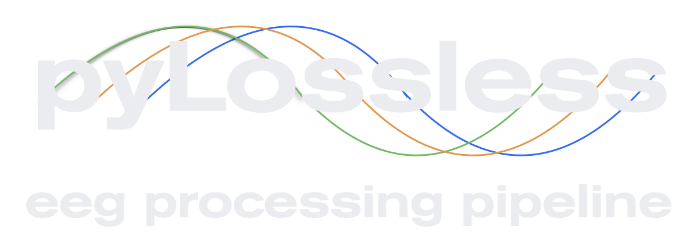

[](https://codecov.io/github/lina-usc/pylossless)




## Introduction to the Lossless Pipeline

This EEG processing pipeline is especially useful for the following scenarios:

- You want to keep your EEG data in a continous state, allowing you the flexibility to epoch your data at a later stage.
- You are part of a research team or community that shares a common dataset, and you want to ensure data processing happens only once, in a way that is useful to all collaborators.

## Background and Purpose

This project arose from a real-world use-case: We had a dataset of +1,500 infant EEG recordings from multiple studies. The event markers were inconsistent across recordings, and the EEG data were noisy. Multiple researchers needed to analyze the data, and we wanted to avoid a scenario where each person processed the data independently. We set out to orchestrate a single comprehensive effort to produce a clean version of the dataset, which each researcher could use for their own analysis. 

## The gist of the Lossless pipeline 

The Lossless pipeline was designed keep EEG recordings in their continuous nature. It _annotates_ bad channels, bad time periods, and artifactual independent components. The pipeline also provides a visual dashboard that displays the EEG recording, its respective ICA, and all the pipeline decisions. This allows the reviewer to quickly confirm that noisy sensors, time periods, and components were sufficiently identified by the pipeline on any given recording. With this tool, we were able to complete a thorough cleaning of the aforementioned 1,500 recording dataset. Individual researchers were then able purge the artifacts identified by the pipeline and epoch the data at the time of their own analysis.

## 📘 Installation and usage instructions

This package can be install from PyPI with
```bash
$ pip install pylossless
```

The development version can be installed from GitHub with
```bash
$ git clone git@github.com:lina-usc/pylossless.git
$ pip install --editable ./pylossless
```
for an editable installation, or simply with 
```bash
$ pip install git+https://github.com/lina-usc/pylossless.git
```
for a static version. 

Please find the full documentation at
[**pylossless.readthedocs.io**](https://pylossless.readthedocs.io/en/latest/index.html).


## ▶️ Running the pyLossless Pipeline
Below is a minimal example that runs the pipeline one of MNE's sample files.  
```
import pylossless as ll 
import mne
fname = mne.datasets.sample.data_path() / 'MEG' / 'sample' /  'sample_audvis_raw.fif'
raw = mne.io.read_raw_fif(fname, preload=True)

config = ll.config.Config()
config.load_default()
config.save("my_project_ll_config.yaml")

pipeline = ll.LosslessPipeline('my_project_ll_config.yaml')
pipeline.run_with_raw(raw)
```

Once it is completed, You can see what channels and times were flagged:
```
print(pipeline.flagged_chs)
print(pipeline.flagged_epochs)
```

Once you are ready, you can save your file:
```
pipeline.save(pipeline.get_derivative_path(bids_path), overwrite=True)
```

## 👩‍💻 Dashboard Review
[](https://colab.research.google.com/github/lina-usc/pylossless/blob/main/notebooks/qc_example.ipynb)


After running the Lossless pipeline, you can launch the Quality Control
Review (QC) dashboard to review the pipeline's decisions on each file!
You can flag additional channels, times and components, and edit flags
made by the pipeline.

First install the dashboard requirements
```bash
$ cd ./path/to/pylossless/on/your/computer
$ pip install --editable .[dash]
```

```bash
$ pylossless_qc
```

## ▶️ Example HPC Environment Setup

If you are a Canadian researcher working on an HPC system such as [Narval](https://docs.alliancecan.ca/wiki/Narval/en):

```bash
module load python/3.10

# Build the virtualenv in your homedir
virtualenv --no-download eeg-env
source eeg-env/bin/activate

pip install --no-index mne
pip install --no-index pandas
pip install --no-index xarray
pip install --no-index pyyaml
pip install --no-index sklearn
pip install mne_bids

# Clone down mne-iclabel and switch to the right version and install it locally
git clone https://github.com/mne-tools/mne-icalabel.git
cd mne-icalabel
git checkout maint/0.4
pip install .

# Clone down pipeline and install without reading dependencies
git clone git@github.com:lina-usc/pylossless.git
cd pylossless
pip install --no-deps .

# Verify that the package has installed correct with an import
python -c 'import pylossless'
```
