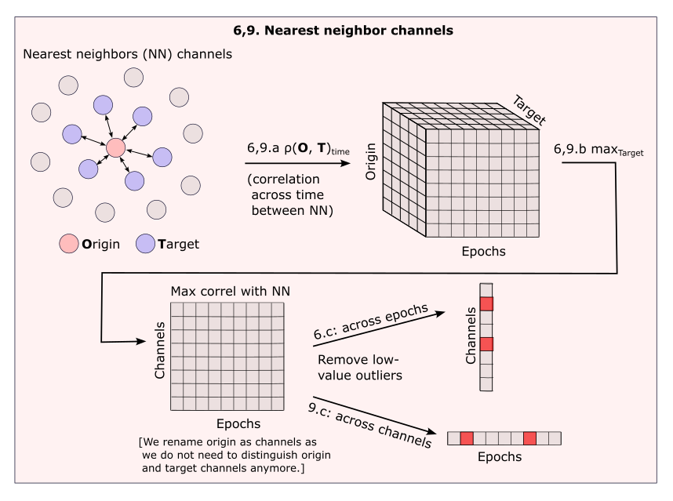
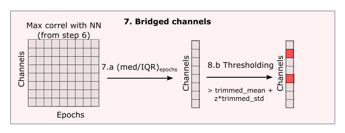
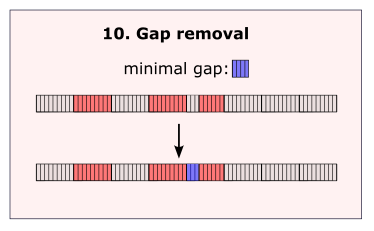

Implementation
==============

The lossless pipeline be broken down into the following steps in Figure 1a.

.. figure:: _images/pipeline_schema.png
    
    *Figure 1a)* Steps of the lossless pipeline

Step 0: Making your data BIDS compliant
---------------------------------------

The Lossless Pipeline expects the input data to comply with the BIDS standard.
This assures that this pipeline knows how to load/save your data, and find important
information (like channel names and locations), regardless
of which manufacurer you used to collect your data.

If you are not familiar with the BIDS standard for EEG data, see
`the MNE-BIDS website <https://mne.tools/mne-bids/stable/index.html>`__ for
information on how to make your data BIDS compliant using Python.

Step 1: "Staging" Your data
---------------------------

The first step of the pipeline is optional, but allows the user to carry out
any operations on the data prior to running the rest of the pipeline.

The most common staging operation will be identifying **break periods** that
should *not* be considered by pipeline methods (because they are likely
noisy, not representative of the data, and will not be used in analyses).

Specifying parameters for finding breaks can be done directly in the YAML
config file provided by pyLossless. For other staging operations, the user
will have to provide their own script.

.. todo::
    TODO: create a tutorial for creating/using a custom staging script.

Step 2: Identifying Outlier Channels
------------------------------------
.. figure:: _images/pipeline_step_2.png

    *Figure 1b*) Step 2: Identifying Outlier Channels

    .. todo::
        TODO: explain this step

Steps 3 & 4: Identifying Channels & Epochs with large standard deviations
-------------------------------------------------------------------------

.. list-table::
   :class: borderless

   * - .. figure:: _images/pipeline_step_3.png
            :align: center

            *Figure 1c*) Step 3: Identify Channels with large standard deviations
     - .. figure:: _images/pipeline_step_4.png
            :align: center

            *Figure 1d*) Step 4: Identify Epochs with large standard deviations across
            channels

.. todo::
    TODO: explain this step

Step 5: Filtering
-----------------
By default, the pipeline will filter the data with a 1Hz highpass. This is a
requirement for running ICA, as low frequency oscillations are known to
adversely affect ICA decomposition.

Additional filtering parameters for lowpass and notch filtering can be set in
the YAML config file provided by pyLossless.

Step 6: Identifying nearest neighbor channels
---------------------------------------------

    *Figure 1e)*: Steps 6: Identifying nearest neighbor channels

.. todo::
    TODO: explain this step

Step 7: Identifying bridged channels
------------------------------------

    *Figure 1f)*: Step 7: Identifying bridged channels

.. todo::
    TODO: explain this step

Step 8: Identifying the rank channel
------------------------------------

.. figure:: _images/pipeline_step_8.png

    *Figure 1g)*: Step 8: Identifying the rank channel

.. todo::
    TODO: explain this step

Step 9: Identifying nearest neighbor channels
---------------------------------------------

    *Figure 1h)*: Step 9: Identifying nearest neighbor channels

.. todo::
    TODO: explain this step

Step 10: Identifying small time periods between flagged epochs
---------------------------------------------------------------

    *Figure 1i)*: Step 10: Identifying small time periods between flagged epochs

.. todo::
    TODO: explain this step

Step 11: Run initial ICA
------------------------

The pyLossless pipeline will run an initial ICA that will only be used for step 11
(identifying epochs with large standard deviations across ICs).

By default, the fastICA algorithm is used for efficiency.

Step 11: Identify Epochs with large standard deviations across ICs
------------------------------------------------------------------

.. figure:: _images/pipeline_step_12.png

    *Figure 1j)*: Step 12: Epochs with large standard deviations across ICs

.. todo::
    TODO: explain this step

Step 13: Run final ICA
----------------------

A final ICA will be run, excluding the epochs that were identified to contain
large deviations across ICs. These time periods are exlcuded to improve the
final ICA's decomposition.

MNE-ICAlabel will be run on this decomposition to classify the ICs as brain,
or a category of artifact.

By default, Extended infomax is used for the final ICA.

Step 14: Identifying small time periods between flagged epochs
---------------------------------------------------------------

Again, the pipeline will identify small periods between any new epochs that
have been flagged as artefactual in step 11.

    *Figure 1i)*: Step 14: Identifying small time periods between flagged epochs

Step 15: Save data
------------------
The pipeline will save the data in a folder named ``derivatives/pyLossless``
in the bids root directory.

- By default, the pipeline will save EEG data in the European Data Format (``EDF``). 
- The pipeline will save each ICA decomposition in  the ``.fif`` format.
- Finally, the pipeline will save the IC labels in a ``.tsv`` file.

Step 16: Expert Quality Control (QCR)
-------------------------------------

The last step of the pipeline is for the user to review the pipelines decisions
for each file. For this, the pyLossless pipeline will provide a dashboard to
the user. 

.. todo::
    TODO: Finish the dashboard and provide a tutorial and demo